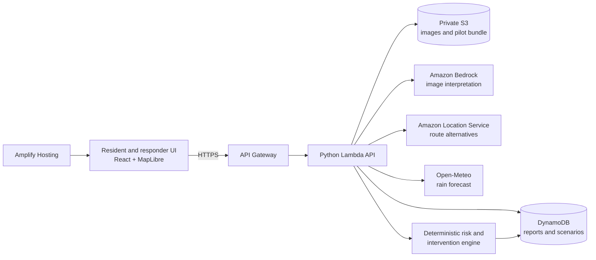

# Varuna — Architecture

**Version:** 1.0 · 8 October 2026  
**Scope:** One pilot area, 30–50 road segments, two user views

## 1. System shape

**Deployment choice:** React + TypeScript + Vite frontend on AWS Amplify Hosting; Python API on API Gateway + Lambda; private S3 for report media and versioned pilot files; DynamoDB for mutable reports/scenarios; Amazon Bedrock for image interpretation; Amazon Location Service for candidate routes. The risk and simulation logic lives in ordinary Python and remains runnable locally from fixed fixtures.

The AWS account, selected region, Bedrock model access, and Location Service availability must be checked at setup. If a service is unavailable, retain the documented interface and use a labelled local fixture for the demo; do not imply that fixture output came from a live AWS call. A deployed API plus S3 provides genuine AWS use even if a model is temporarily unavailable.

## 2. Source data and preparation

| Input | Initial source | Use | Known limit |
| --- | --- | --- | --- |
| Road lines and junctions | OpenStreetMap extract, manually checked around DTU | Pilot graph and snap targets | Missing or wrong pedestrian connections |
| Terrain | Copernicus GLO-30 where available, otherwise GLO-90 | Coarse relative low-point prior | Surface model at 30/90 m; does not resolve road drainage |
| Rain | Open-Meteo hourly precipitation forecast | Live rainfall context | Forecast is spatially coarse and uncertain |
| Demo rain | Versioned JSON scenario | Reproducible judging flow | Synthetic; clearly marked in UI |
| Drain | Two manually placed scenario nodes, checked against the pilot map | Intervention candidates | Illustrative choke points, not a verified drainage network |
| Photo report | User-uploaded image and chosen location | Local visible-hazard evidence | Can be stale, inaccurate, or mislocated |

The pilot bundle is a versioned GeoJSON/JSON package in S3: `segments.geojson`, `nodes.geojson`, `drains.geojson`, `terrain.json`, `scenario.json`, and `manifest.json` with source URLs, licences, preparation date, and checksums. Use one immutable bundle version per demo run.

## 3. Domain model

| Entity | Required fields |
| --- | --- |
| `Segment` | `id`, `geometry`, `fromNode`, `toNode`, `lengthM`, `terrainPrior?`, `drainageVulnerability?`, `source`, `bundleVersion` |
| `Report` | `id`, `segmentId`, `point`, `createdAt`, `capturedAt?`, `imageKey`, `reviewStatus`, `observations`, `modelConfidence?`, `source` |
| `WeatherSnapshot` | `mode: live|scenario`, `precipitationMmH`, `validAt`, `fetchedAt`, `provider`, `scenarioId?` |
| `RiskSnapshot` | `segmentId`, `score?`, `class`, `coverage`, `features`, `evidenceIds`, `computedAt`, `modelVersion` |
| `RouteCandidate` | `id`, `geometry`, `travelMinutes`, `segmentIds`, `exposure`, `blocked`, `provenance` |
| `InterventionRun` | `id`, `drainId`, `baselineSnapshotId`, `affectedSegmentIds`, `before`, `after`, `assumptions`, `createdAt` |
| `Closure` | `segmentId`, `status`, `reason`, `setBy`, `setAt`, `expiresAt?` |

`null` or absent inputs must remain unknown. Zero means an observed or curated zero, never “data unavailable.” All public API times use ISO 8601 UTC; the UI formats them for India Standard Time. Geometry uses WGS84 longitude/latitude, and distance calculations use a projected or geodesic method rather than raw degree subtraction.

## 4. Risk engine (pilot heuristic v1)

The score is an **ordinal risk indicator**, not an estimated water depth or flood probability. Normalize each available feature to 0–1:

- `R`: rainfall intensity against pilot scenario thresholds.
- `T`: relative terrain susceptibility among pilot segments, with low points scoring higher.
- `D`: curated drainage vulnerability, including the known blocked drain.
- `O`: accepted, recent observation evidence on the segment. A one-hop connected neighbour can receive attenuated context only if it is also lower lying; never auto-copy a report across the graph.

Base weights: `R 0.35`, `T 0.25`, `D 0.20`, `O 0.20`. Compute `score = sum(weight × feature) / sum(weights of available features)`. Also calculate `coverage = sum(weights of available features)` and publish the feature values. This normalization prevents an absent report from becoming an artificial zero. Weather and at least one local context feature (`T` or `D`) are required for a numeric score. Otherwise return `Unknown`.

Initial display bands: Low `< 0.35`, Watch `0.35–<0.60`, High `≥ 0.60`. These are product thresholds for comparison, to be fixed in versioned configuration and tested on scenarios. Show `Low confidence` when coverage is below 0.80 or the weather/report is stale. A confirmed closure is a separate operator state and overrides route eligibility regardless of score.

An accepted report changes `O` only on its snapped segment and, where the rule above applies, a single neighbour. Rejected and pending reports do not enter the public score. Every recalculation produces an immutable `RiskSnapshot` referenced by route and intervention results.

## 5. Route selection

1. Request available alternative route geometries and travel times from Amazon Location Service for the selected mode.
2. Intersect each geometry with pilot road segments using a small buffered corridor. Record unmatched route length; a candidate with substantial unmatched length is `unassessed`.
3. Exclude candidates crossing an operator-confirmed closed segment. Do not turn a high heuristic score into a hard closure.
4. For each remaining candidate, calculate `exposure = Σ(segment distance on route × segment score) / total assessed route distance`. Also surface the maximum segment class and the share of route length with unknown risk.
5. Select the lower-exposure candidate only if it meaningfully improves on the fastest route; use a configurable threshold (initially ≥ 0.10 lower exposure) and show its additional minutes. Otherwise present the fastest as the default with an exposure note.

Do not return “safe” if every candidate is high, unknown, or blocked. Show the comparison and “No lower-exposure route found.” If Location Service returns no viable alternatives, the user gets an explicit unavailable state. The pilot graph can supply a labelled, deterministic replay route for the demo, but it is not represented as a live provider route.

## 6. Intervention simulation

The P0 action is **clear a modelled blocked drain**. Each of two scenario nodes has an explicitly curated set of affected segments. The simulator reduces `D` on those segments by a configured amount (initial pilot assumption: `−0.5`, floored at zero), recalculates scores, and re-scores the same route candidates. It leaves rain, terrain, and observation evidence untouched.

Run both candidates against the same baseline. Rank first by reduction in exposure on the user's selected route, then by the number of segments moving out of High, then by stable drain ID. Return a before/after table of segment classes, exposure, and affected route count. If neither has an estimated benefit, say so. Do not write either simulated result over baseline data. Store assumptions with each run so the demo can explain what changed. This is a comparative “what if” estimate; it cannot predict how quickly real water would clear.

## 7. API surface

| Method and path | Purpose |
| --- | --- |
| `GET /v1/pilot` | Pilot geometry, sources, version, and map metadata |
| `GET /v1/snapshots/current?mode=` | Weather and risk snapshot for live or scenario mode |
| `POST /v1/reports/upload-url` | Short-lived presigned S3 upload URL |
| `POST /v1/reports` | Report metadata and image key; starts interpretation |
| `PATCH /v1/reports/{id}/review` | Authorized accept/reject action |
| `PATCH /v1/segments/{id}/closure` | Authorized set/clear of a confirmed closure, with audit metadata |
| `POST /v1/routes/compare` | Origin, destination, travel mode, snapshot ID → alternatives |
| `POST /v1/interventions/compare` | Two drain IDs + baseline snapshot ID + selected route → ranked before/after comparison |

Validate input geometry inside pilot bounds, file type and size, enum values, and report timestamps. Return structured errors (`code`, `message`, `retryable`, `requestId`). Long-running image interpretation may return a pending report and complete asynchronously; the UI polls its status. Use idempotency keys on report creation and simulation requests.

## 8. AWS, security, and operations

- **Identity:** Public demo can read pilot and scenario data. Report review and intervention authoring require an operator identity. Use a simple authenticated operator account; never put AWS credentials or Bedrock access in the browser.
- **S3:** Private media bucket, short-lived presigned upload URLs, encryption at rest, object lifecycle for demo media. Strip EXIF GPS from displayed derivatives.
- **DynamoDB:** `Reports` keyed by report ID with a segment/time index; `ScenarioRuns` keyed by run ID; `Closures` keyed by segment ID with an audit trail. TTL may remove demo reports after the event, with a retained fixture for replay.
- **Lambda:** One API handler or a small group of handlers, bounded timeouts, request IDs, structured logs, and environment variables for table/bucket/model IDs.
- **Bedrock:** Invoke a vision-capable model using Converse; validate its JSON against a schema and reject invalid or unsafe output. Check model access and pricing in the chosen region during setup.
- **Cost:** Set an AWS budget alarm before running the demo; limit image dimensions, API rate, and model calls; cache unchanged risk snapshots.
- **Reliability:** Weather provider failure returns the last timestamped snapshot or offers scenario mode. Model failure leaves the report pending/manual review. Routing failure presents the map and an unavailable message; it does not invent a route.

## 9. Verification before submission

- Unit tests: score normalization, missing-data behavior, report acceptance, one-hop rule, closure exclusion, intervention isolation.
- Fixture integration test: identical scenario inputs produce identical segment rankings and route exposures.
- API smoke test: upload → interpretation → review → updated snapshot → route comparison → intervention comparison.
- Visual check: phone and desktop, keyboard navigation, legend, timestamps, unknown state, scenario label.
- AWS proof: record one real backend request, S3 object, and Bedrock response for the demo, with no keys or private identifiers visible.

## 10. Sources

- [Amazon Bedrock Converse image input](https://docs.aws.amazon.com/bedrock/latest/userguide/conversation-inference.html)
- [Amazon Location Service route alternatives](https://docs.aws.amazon.com/location/latest/developerguide/calculate-routes-alternate.html)
- [Copernicus DEM on AWS](https://registry.opendata.aws/copernicus-dem/)
- [Open-Meteo Forecast API](https://open-meteo.com/en/docs)
- [Product Requirements Document.md](Product%20Requirements%20Document.md), [Agents.md](Agents.md), [Design-System.md](Design-System.md)
